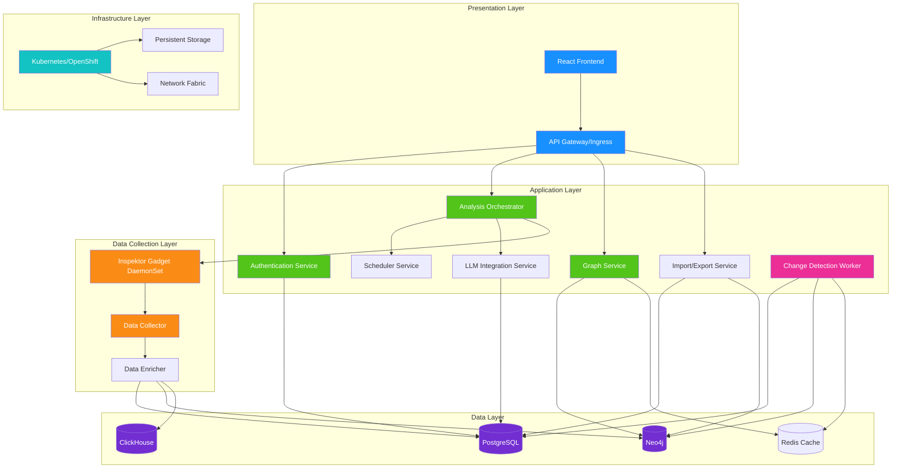
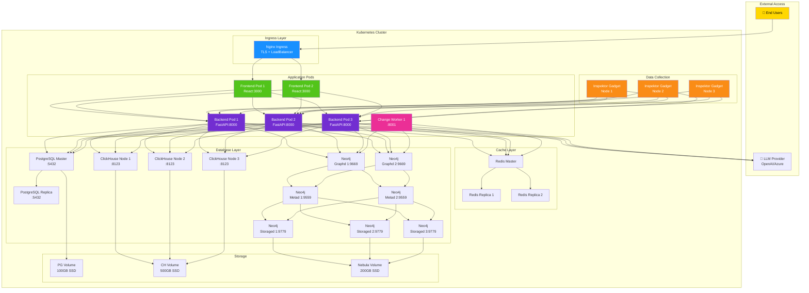
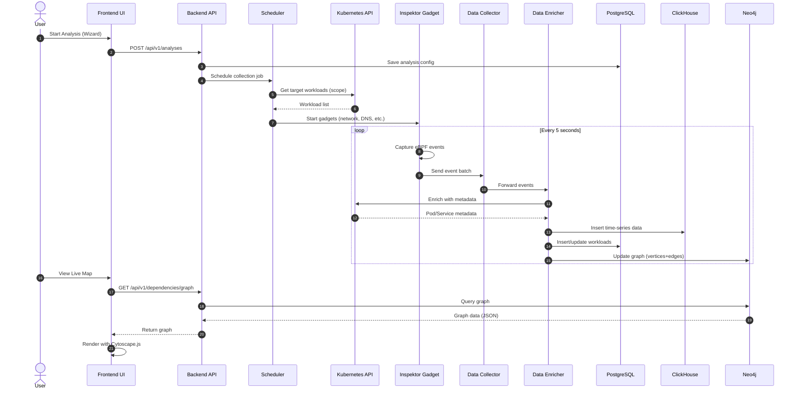
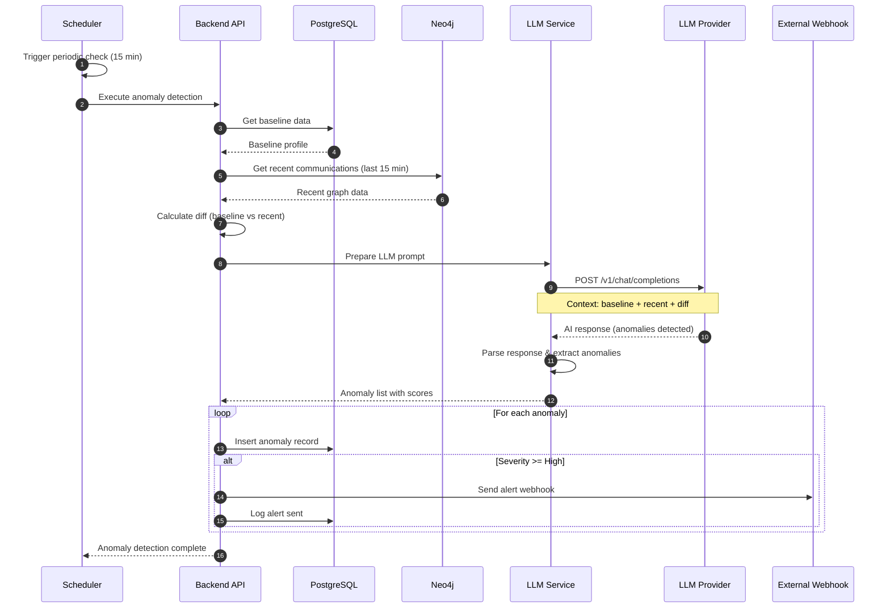
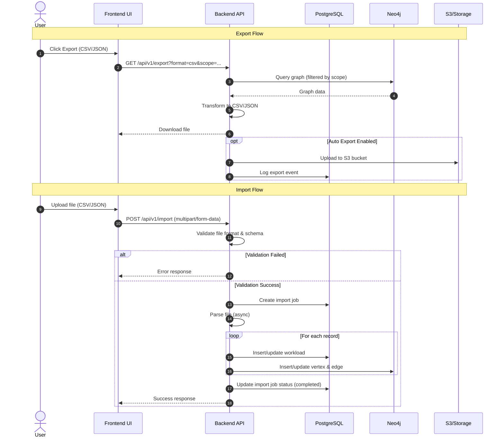
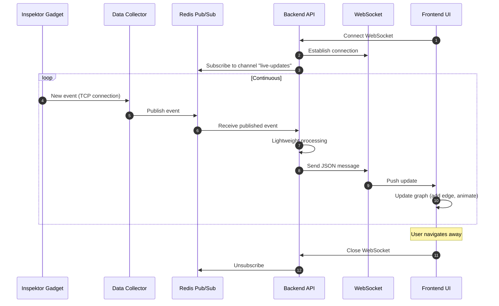
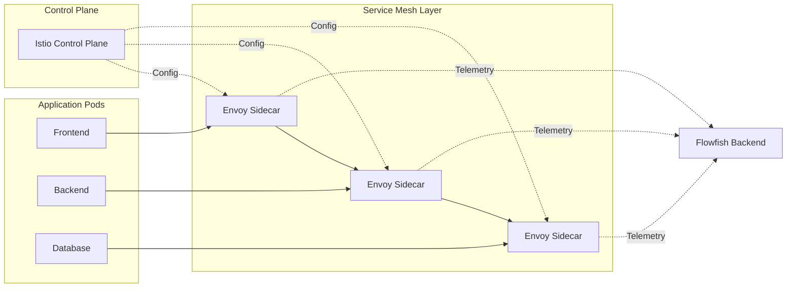

# Flowfish - Sistem Mimarisi

Bu dokümant, Flowfish platformunun teknik mimarisini detaylı olarak açıklar.

## 📋 İçindekiler

- [Genel Bakış](#genel-bakış)
- [Mantıksal Mimari](#mantıksal-mimari)
- [Fiziksel Mimari](#fiziksel-mimari)
- [Veri Akış Diyagramları](#veri-akış-diyagramları)
- [Component Detayları](#component-detayları)
- [Veri Modeli](#veri-modeli)
- [API Mimarisi](#api-mimarisi)
- [Deployment Mimarisi](#deployment-mimarisi)

---

## Genel Bakış

Flowfish, mikro servis mimarisi prensiplerine göre tasarlanmış, Kubernetes/OpenShift native bir platformdur. eBPF tabanlı veri toplama, çoklu veritabanı kullanımı ve modern web teknolojileri ile yüksek performanslı, ölçeklenebilir bir çözüm sunar.

### Temel Prensipler

1. **Cloud-Native**: Kubernetes/OpenShift için optimize edilmiş
2. **Scalable**: Horizontal scaling desteği
3. **Resilient**: Fault-tolerant, self-healing
4. **Observable**: Comprehensive logging, metrics, tracing
5. **Secure**: Multi-tenant, RBAC, encryption
6. **Modular**: Loosely coupled components

---

## Mantıksal Mimari

### Mimari Katmanlar

Flowfish 5 ana katmandan oluşur:



### Katman Açıklamaları

#### 1. Presentation Layer (Sunum Katmanı)

**React Frontend:**
- Single Page Application (SPA)
- Ant Design component library
- Cytoscape.js for graph visualization
- Redux for state management
- Axios for API communication
- WebSocket for real-time updates

**API Gateway/Ingress:**
- Nginx Ingress Controller
- TLS termination
- Rate limiting
- Request routing
- Load balancing

#### 2. Application Layer (Uygulama Katmanı)

**Authentication Service:**
- JWT token generation/validation
- OAuth 2.0 provider integration
- Kubernetes SA authentication
- Session management
- RBAC enforcement

**Analysis Orchestrator:**
- Wizard workflow management
- Analysis lifecycle management (start, stop, monitor)
- Scope-based filtering
- Gadget module configuration
- Result aggregation

**Graph Service:**
- Neo4j query execution
- Graph traversal algorithms
- Real-time graph updates
- Graph snapshot management
- Graph export/import

**Import/Export Service:**
- CSV parsing and generation
- Graph JSON serialization
- Batch processing
- Format validation
- Version control

**LLM Integration Service:**
- LLM provider abstraction (OpenAI, Azure, Anthropic)
- Prompt engineering
- Response parsing
- Anomaly scoring
- Context window management

**Scheduler Service:**
- Cron-based job scheduling
- Periodic analysis execution
- Baseline creation jobs
- Export automation
- Report generation

**Change Detection Worker (Scalable Microservice):**
- Standalone Pod deployment
- Horizontally scalable with leader election (Redis)
- Periodic infrastructure change detection
- Workload and connection change monitoring
- Risk assessment and blast radius calculation
- Real-time WebSocket notifications for critical changes
- Circuit breaker pattern for resilience
- **Hybrid Storage Architecture (NEW):**
  - Dual-write: PostgreSQL (ACID) + RabbitMQ/ClickHouse (analytics)
  - Run-based filtering (filter changes by analysis run)
  - Analysis lifecycle-based data retention (no TTL)

#### 3. Data Collection Layer (Veri Toplama Katmanı)

**Inspektor Gadget DaemonSet:**
- eBPF program loading
- Kernel event capture
- Pod-level data collection
- Minimal overhead monitoring
- Configurable gadgets (network, DNS, TCP, process, syscall, file)

**Data Collector:**
- Event stream aggregation
- Data buffering
- Batch insertion
- Error handling and retry
- Back-pressure management

**Data Enricher:**
- Kubernetes API integration
- Pod/Deployment/Service metadata enrichment
- Label and annotation extraction
- Namespace and cluster tagging
- IP-to-workload mapping

#### 4. Data Layer (Veri Katmanı)

**PostgreSQL:**
- Relational data (users, clusters, analyses, configurations)
- ACID compliance
- Foreign key relationships
- JSONB support for flexible schemas
- Full-text search

**Neo4j:**
- Graph data (workloads as vertices, communications as edges)
- Distributed graph storage
- Fast graph traversal
- Property graph model
- GQL (Graph Query Language)

**ClickHouse:**
- Time-series data (network flows, metrics, events)
- Columnar storage
- High compression ratios
- Fast analytical queries
- Partitioning and sharding

**Redis:**
- Session cache
- Real-time metrics cache
- Rate limiting counters
- Pub/Sub for real-time updates
- Distributed locks

#### 5. Infrastructure Layer (Altyapı Katmanı)

**Kubernetes/OpenShift:**
- Container orchestration
- Service discovery
- Auto-scaling (HPA, VPA)
- Self-healing
- ConfigMaps and Secrets

**Persistent Storage:**
- StatefulSet volumes (databases)
- PersistentVolumeClaims
- Storage classes (SSD, HDD)
- Volume snapshots
- Backup/restore

**Network Fabric:**
- CNI (Container Network Interface)
- Network policies
- Service mesh (optional: Istio, Linkerd)
- Ingress controllers
- Load balancers

---

## Fiziksel Mimari

### Deployment Architecture



### Resource Allocation

#### Frontend (React)

```yaml
Replicas: 2-5 (HPA)
Resources:
  requests:
    cpu: 100m
    memory: 256Mi
  limits:
    cpu: 500m
    memory: 512Mi
```

#### Backend (FastAPI)

```yaml
Replicas: 3-10 (HPA)
Resources:
  requests:
    cpu: 500m
    memory: 1Gi
  limits:
    cpu: 2000m
    memory: 4Gi
```

#### PostgreSQL

```yaml
Replicas: 1 master + 1 replica
Resources:
  requests:
    cpu: 1000m
    memory: 4Gi
  limits:
    cpu: 4000m
    memory: 8Gi
Storage: 100GB SSD (PVC)
```

#### ClickHouse

```yaml
Replicas: 3 nodes (distributed)
Resources (per node):
  requests:
    cpu: 2000m
    memory: 8Gi
  limits:
    cpu: 8000m
    memory: 16Gi
Storage: 500GB SSD per node (PVC)
```

#### Neo4j

```yaml
Graph nodes: 2
Meta nodes: 2
Storage nodes: 3

Resources (per graph/meta):
  requests:
    cpu: 1000m
    memory: 2Gi
  limits:
    cpu: 4000m
    memory: 8Gi

Resources (per storage):
  requests:
    cpu: 2000m
    memory: 4Gi
  limits:
    cpu: 8000m
    memory: 16Gi

Storage: 200GB SSD per storage node (PVC)
```

#### Redis

```yaml
Replicas: 1 master + 2 replicas
Resources:
  requests:
    cpu: 500m
    memory: 2Gi
  limits:
    cpu: 2000m
    memory: 4Gi
```

#### Inspektor Gadget (DaemonSet)

```yaml
Pods: 1 per node (automatically)
Resources (per pod):
  requests:
    cpu: 100m
    memory: 256Mi
  limits:
    cpu: 500m
    memory: 512Mi
```

#### Change Detection Worker

```yaml
Replicas: 1 (single) or 3+ (with leader election)
Resources:
  requests:
    cpu: 100m
    memory: 256Mi
  limits:
    cpu: 500m
    memory: 512Mi
Leader Election: Redis-based (optional)
```

---

## Veri Akış Diyagramları

### 1. Veri Toplama Akışı



### 2. Anomaly Detection Akışı



### 3. Import/Export Akışı



### 4. Real-Time Update Akışı



---

## Component Detayları

### Backend API (FastAPI)

#### Teknoloji Stack
- **Framework**: FastAPI 0.100+
- **Language**: Python 3.11+
- **ASGI Server**: Uvicorn
- **Async Libraries**: asyncio, aiohttp, asyncpg
- **ORM**: SQLAlchemy 2.0+ (async)
- **Validation**: Pydantic v2
- **Authentication**: python-jose (JWT), authlib (OAuth)

#### Modül Yapısı

```
backend/
├── main.py                      # FastAPI app initialization
├── config.py                    # Configuration management
├── models/                      # SQLAlchemy models
│   ├── user.py
│   ├── cluster.py
│   ├── analysis.py
│   ├── workload.py
│   ├── communication.py
│   ├── anomaly.py
│   └── baseline.py
├── schemas/                     # Pydantic schemas (API contracts)
│   ├── user_schemas.py
│   ├── cluster_schemas.py
│   └── ...
├── routers/                     # API route handlers
│   ├── auth.py
│   ├── clusters.py
│   ├── analyses.py
│   ├── workloads.py
│   ├── communications.py
│   ├── dependencies.py
│   ├── anomalies.py
│   ├── changes.py
│   ├── export.py
│   └── import.py
├── services/                    # Business logic
│   ├── auth_service.py
│   ├── analysis_service.py
│   ├── graph_service.py
│   ├── llm_service.py
│   ├── export_service.py
│   ├── scheduler_service.py
│   └── change_detection_service.py  # Change detection core logic
├── workers/                     # Background workers (optional embedded mode)
│   ├── __init__.py
│   └── change_detection_worker.py
├── worker_main.py               # Standalone worker entry point
├── collectors/                  # Data collection logic
│   ├── gadget_collector.py
│   ├── data_enricher.py
│   └── k8s_client.py
├── database/                    # Database connections
│   ├── postgresql.py
│   ├── clickhouse.py
│   ├── neo4j.py
│   └── redis.py
├── middleware/                  # Custom middleware
│   ├── auth_middleware.py
│   ├── rbac_middleware.py
│   ├── logging_middleware.py
│   └── rate_limit_middleware.py
├── utils/                       # Utility functions
│   ├── jwt_utils.py
│   ├── crypto_utils.py
│   ├── date_utils.py
│   └── graph_utils.py
├── tests/                       # Unit & integration tests
│   ├── test_auth.py
│   ├── test_analyses.py
│   └── ...
└── requirements.txt             # Python dependencies
```

#### API Endpoints (Summary)

```
/api/v1/
├── auth/
│   ├── POST /login
│   ├── POST /logout
│   ├── POST /refresh
│   ├── GET /me
│   └── POST /oauth/{provider}
├── users/
│   ├── GET /
│   ├── POST /
│   ├── GET /{id}
│   ├── PUT /{id}
│   └── DELETE /{id}
├── clusters/
│   ├── GET /
│   ├── POST /
│   ├── GET /{id}
│   ├── PUT /{id}
│   ├── DELETE /{id}
│   └── GET /{id}/namespaces
├── analyses/
│   ├── GET /
│   ├── POST /
│   ├── GET /{id}
│   ├── PUT /{id}
│   ├── DELETE /{id}
│   ├── POST /{id}/start
│   ├── POST /{id}/stop
│   └── GET /{id}/status
├── workloads/
│   ├── GET /pods
│   ├── GET /deployments
│   ├── GET /statefulsets
│   └── GET /services
├── communications/
│   ├── GET /
│   ├── GET /{id}
│   └── GET /stats
├── dependencies/
│   ├── GET /graph
│   ├── GET /map
│   ├── GET /upstream/{workload_id}
│   └── GET /downstream/{workload_id}
├── anomalies/
│   ├── GET /
│   ├── GET /{id}
│   ├── PUT /{id}
│   └── POST /{id}/resolve
├── changes/
│   ├── GET /
│   ├── GET /{id}
│   └── GET /timeline
├── baselines/
│   ├── GET /
│   ├── POST /
│   ├── GET /{id}
│   └── DELETE /{id}
├── export/
│   ├── GET /csv
│   ├── GET /graph-json
│   └── POST /schedule
└── import/
    ├── POST /csv
    ├── POST /graph-json
    └── GET /jobs/{id}
```

### Frontend (React)

#### Teknoloji Stack
- **Framework**: React 18+
- **UI Library**: Ant Design 5+
- **Graph Visualization**: Cytoscape.js
- **State Management**: Redux Toolkit + RTK Query
- **Routing**: React Router v6
- **HTTP Client**: Axios
- **Real-time**: Socket.IO Client
- **Charts**: Recharts / ApexCharts
- **Build Tool**: Vite
- **Language**: TypeScript

#### Component Yapısı

```
frontend/
├── public/
│   └── index.html
├── src/
│   ├── index.tsx                # Entry point
│   ├── App.tsx                  # Root component
│   ├── components/              # Reusable components
│   │   ├── Layout/
│   │   │   ├── Header.tsx
│   │   │   ├── Sidebar.tsx
│   │   │   └── Footer.tsx
│   │   ├── Graph/
│   │   │   ├── CytoscapeGraph.tsx
│   │   │   ├── GraphControls.tsx
│   │   │   ├── GraphFilters.tsx
│   │   │   └── NodeDetailPanel.tsx
│   │   ├── Dashboard/
│   │   │   ├── MetricCard.tsx
│   │   │   ├── ChartCard.tsx
│   │   │   └── TimelineWidget.tsx
│   │   ├── Wizard/
│   │   │   ├── AnalysisWizard.tsx
│   │   │   ├── Step1Scope.tsx
│   │   │   ├── Step2Gadgets.tsx
│   │   │   ├── Step3Time.tsx
│   │   │   └── Step4Output.tsx
│   │   └── Common/
│   │       ├── Table.tsx
│   │       ├── Modal.tsx
│   │       └── Form.tsx
│   ├── pages/                   # Page components
│   │   ├── Login.tsx
│   │   ├── Home.tsx
│   │   ├── ClusterManagement.tsx
│   │   ├── AnalysisWizard.tsx
│   │   ├── LiveMap.tsx
│   │   ├── HistoricalMap.tsx
│   │   ├── ApplicationInventory.tsx
│   │   ├── AnomalyDetection.tsx
│   │   ├── ChangeDetection.tsx
│   │   ├── ImportExport.tsx
│   │   ├── PolicySimulation.tsx
│   │   ├── UserManagement.tsx
│   │   ├── Settings.tsx
│   │   └── Integrations.tsx
│   ├── store/                   # Redux store
│   │   ├── index.ts
│   │   ├── slices/
│   │   │   ├── authSlice.ts
│   │   │   ├── clusterSlice.ts
│   │   │   ├── graphSlice.ts
│   │   │   └── analysisSlice.ts
│   │   └── api/
│   │       ├── authApi.ts
│   │       ├── clusterApi.ts
│   │       └── analysisApi.ts
│   ├── hooks/                   # Custom React hooks
│   │   ├── useAuth.ts
│   │   ├── useWebSocket.ts
│   │   ├── useGraph.ts
│   │   └── useDebounce.ts
│   ├── utils/                   # Utility functions
│   │   ├── api.ts
│   │   ├── graph-utils.ts
│   │   ├── date-utils.ts
│   │   └── format-utils.ts
│   ├── types/                   # TypeScript types
│   │   ├── user.types.ts
│   │   ├── cluster.types.ts
│   │   ├── graph.types.ts
│   │   └── analysis.types.ts
│   ├── styles/                  # Global styles
│   │   ├── variables.less
│   │   ├── global.less
│   │   └── theme.ts
│   └── constants/               # Constants
│       ├── api-endpoints.ts
│       └── colors.ts
├── package.json
├── tsconfig.json
└── vite.config.ts
```

### Database Schemas (High-Level)

#### PostgreSQL Schema

**Core Tables:**
- `users` - User accounts
- `roles` - RBAC roles
- `permissions` - Granular permissions
- `user_roles` - User-role mapping
- `clusters` - Kubernetes/OpenShift clusters
- `namespaces` - Namespace inventory
- `workloads` - Pod, Deployment, StatefulSet, Service
- `communications` - Communication records
- `analyses` - Analysis configurations
- `analysis_runs` - Analysis execution history
- `baselines` - Traffic baselines
- `anomalies` - Detected anomalies
- `change_events` - Change detection events (ACID operations)
- `change_workflow` - Workflow state (acknowledge, review, approve) 🆕
- `analysis_runs` - Analysis run tracking 🆕
- `risk_scores` - Risk scoring data
- `llm_configs` - LLM configuration
- `webhooks` - Webhook configurations
- `audit_logs` - Audit trail
- `import_jobs` - Import job tracking
- `export_jobs` - Export job tracking

#### Neo4j Schema

**Vertex Tags:**
- `Cluster` - Kubernetes cluster
- `Namespace` - Kubernetes namespace
- `Pod` - Kubernetes pod
- `Deployment` - Kubernetes deployment
- `StatefulSet` - Kubernetes statefulset
- `Service` - Kubernetes service

**Edge Types:**
- `COMMUNICATES_WITH` - Network communication
- `PART_OF` - Hierarchical relationship (pod → deployment)
- `EXPOSES` - Service exposure (service → deployment)
- `DEPENDS_ON` - Logical dependency

#### ClickHouse Schema

**Time-Series Tables:**
- `network_flows` - Raw network events
- `dns_queries` - DNS query logs
- `tcp_connections` - TCP connection events
- `request_metrics` - Request latency & frequency
- `process_events` - Process creation/termination
- `syscall_events` - System call tracking
- `file_access_events` - File access logs
- `workload_metadata` - Pod/workload discovery events 🆕
- `change_events` - Infrastructure change events (run-based) 🆕

---

## Deployment Mimarisi

### Kubernetes Namespace Organization

```
flowfish/                        # Main application namespace
├── frontend                     # Frontend deployment
├── backend                      # Backend deployment
├── postgresql                   # PostgreSQL StatefulSet
├── clickhouse                   # ClickHouse StatefulSet
├── neo4j-graphd          # Neo4j graph service
├── neo4j-metad           # Neo4j meta service
├── neo4j-storaged        # Neo4j storage service
└── redis                        # Redis deployment

flowfish-gadget/                 # Inspektor Gadget namespace
└── inspektor-gadget            # DaemonSet
```

### Service Mesh Integration (Optional)

Flowfish, Istio veya Linkerd gibi service mesh'lerle entegre çalışabilir:



**Benefits:**
- Enhanced observability (L7 metrics)
- mTLS enforcement
- Traffic management
- Circuit breaking
- Canary deployments

### High Availability

**Frontend:**
- 2+ replicas
- HPA (CPU > 70%)
- Anti-affinity rules (spread across nodes)

**Backend:**
- 3+ replicas
- HPA (CPU > 70%, Memory > 80%)
- Anti-affinity rules
- Graceful shutdown (30s drain)

**PostgreSQL:**
- Master + Replica (Patroni/Stolon)
- Auto-failover
- Streaming replication

**ClickHouse:**
- 3+ nodes (distributed tables)
- Replication factor: 2
- ZooKeeper for coordination

**Neo4j:**
- 2 graphd (stateless, load balanced)
- 2 metad (HA with Raft)
- 3 storaged (distributed storage, Raft)

**Redis:**
- Sentinel for HA
- 1 master + 2 replicas
- Auto-failover

---

## Güvenlik Mimarisi

### Network Policies

```yaml
# Default deny all ingress
apiVersion: networking.k8s.io/v1
kind: NetworkPolicy
metadata:
  name: default-deny-ingress
  namespace: flowfish
spec:
  podSelector: {}
  policyTypes:
  - Ingress

# Allow frontend -> backend
apiVersion: networking.k8s.io/v1
kind: NetworkPolicy
metadata:
  name: allow-frontend-to-backend
  namespace: flowfish
spec:
  podSelector:
    matchLabels:
      app: backend
  policyTypes:
  - Ingress
  ingress:
  - from:
    - podSelector:
        matchLabels:
          app: frontend
    ports:
    - protocol: TCP
      port: 8000

# Allow backend -> databases
# (similar rules for PostgreSQL, ClickHouse, Neo4j, Redis)
```

### Pod Security

```yaml
apiVersion: v1
kind: Pod
metadata:
  name: backend
spec:
  securityContext:
    runAsNonRoot: true
    runAsUser: 1000
    fsGroup: 2000
    seccompProfile:
      type: RuntimeDefault
  containers:
  - name: backend
    securityContext:
      allowPrivilegeEscalation: false
      readOnlyRootFilesystem: true
      capabilities:
        drop:
        - ALL
```

### Secrets Management

- Kubernetes Secrets (encrypted at rest)
- External Secrets Operator (AWS Secrets Manager, Vault)
- Environment variable injection
- Volume mounts for sensitive files

---

## Monitoring ve Observability

### Metrics (Prometheus)

**Application Metrics:**
- HTTP request rate, latency, errors (RED method)
- Graph query performance
- LLM API call duration
- WebSocket connections
- Background job durations

**Infrastructure Metrics:**
- CPU, memory, disk usage
- Pod restarts
- Network throughput
- Database connection pool

### Logging (ELK/Loki)

**Structured Logging:**
```json
{
  "timestamp": "2024-01-15T10:30:45Z",
  "level": "INFO",
  "service": "backend",
  "component": "analysis_service",
  "trace_id": "abc123",
  "user_id": "user-456",
  "message": "Analysis started",
  "analysis_id": "analysis-789",
  "cluster_id": "cluster-prod"
}
```

### Tracing (Jaeger/Tempo)

- Distributed tracing across services
- OpenTelemetry instrumentation
- Span context propagation
- Trace sampling (10%)

### Alerting (Alertmanager)

**Critical Alerts:**
- Service down (any component)
- Database replication lag > 10s
- Disk usage > 85%
- API error rate > 5%
- LLM API failures > 10/min

**Warning Alerts:**
- High latency (p95 > 500ms)
- Memory usage > 80%
- Slow queries (> 5s)
- WebSocket connection drops

---

## Cluster Connectivity Architecture (December 2025 Update)

### ClusterConnectionManager

Backend, Kubernetes cluster'larına erişim için merkezi bir `ClusterConnectionManager` servisi kullanır.

```
┌─────────────────────────────────────────────────────────────────┐
│                    ClusterConnectionManager                      │
├─────────────────────────────────────────────────────────────────┤
│  Özellikler:                                                     │
│  ✅ Connection pooling (cluster başına cache)                   │
│  ✅ Otomatik connection type detection (in-cluster/remote)      │
│  ✅ Fernet encryption ile credential yönetimi                   │
│  ✅ Background health monitoring (circuit breaker)              │
│  ✅ Unified API                                                  │
└─────────────────────────────────────────────────────────────────┘
                              │
              ┌───────────────┴───────────────┐
              ▼                               ▼
┌──────────────────────────┐    ┌──────────────────────────┐
│   InClusterConnection    │    │  RemoteTokenConnection   │
│   (gRPC to cluster-mgr)  │    │  (Direct K8s API)        │
└──────────────────────────┘    └──────────────────────────┘
```

### Connection Types

| Type | Use Case | Backend Implementation |
|------|----------|----------------------|
| **in-cluster** | Flowfish aynı cluster'da | gRPC → cluster-manager pod |
| **token** | Remote cluster (ServiceAccount) | httpx → K8s API Server |
| **kubeconfig** | Remote cluster (kubeconfig file) | kubernetes-client → K8s API |

### Key Files

```
backend/services/
├── cluster_connection_manager.py    # Unified manager singleton
├── connections/
│   ├── base.py                      # Abstract ClusterConnection
│   ├── in_cluster.py                # InClusterConnection
│   └── remote_token.py              # RemoteTokenConnection
├── health/
│   └── cluster_health_monitor.py    # Background health checks
└── cluster_cache_service.py         # Redis cache (uses manager)
```

### Multi-Cluster Analysis Support

Flowfish, birden fazla cluster üzerinde analiz yapabilir:

- **Analysis ID Format**: 
  - Single cluster: `{analysis_id}`
  - Multi-cluster: `{analysis_id}-{cluster_id}`
- **Data Isolation**: Her cluster'ın verileri ayrı tutulur
- **Unified View**: Frontend tüm cluster verilerini birleştirir

---

**Versiyon**: 2.0.0  
**Son Güncelleme**: Ocak 2026  
**Durum**: Implementasyon Dokümantasyonu  
**Mimari**: Hybrid Change Detection (PostgreSQL + ClickHouse)

